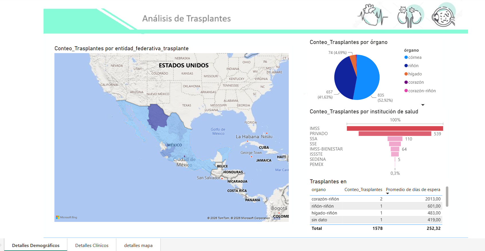
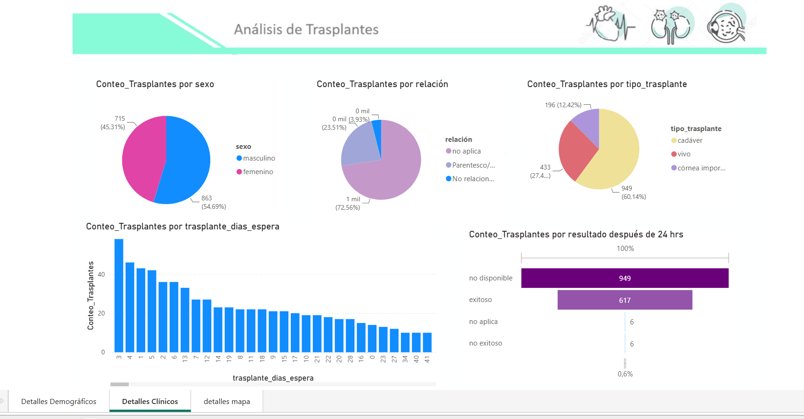

# portafolio
Dashboard interactivo en Power BI del proyecto Análisis de Trasplantes de la CENATRA.  

# Informe trasplantes CENATRA

Informe sobre los trasplantes realizados en México del primer trtimestre del 2025, contiene un mapa donde se indica cuántos trasplantes se hicieron por estado de la república, así como cuáles órganos se trasplantaron, en qué institución de salud se realizó el trasplante, cuantós días de espera tuvieron que esperar los pacientes en lista, entreo otros datos demográficos. 

En la pestaña Detalles Clínicos. Se muestran gráficas que presentan la cantidad de trasplantes realizados deacuerdo a variables como sexo, que relación tenía el donante con el paciante que recibió el óirgano, el origen del órgano (si fue de un vivo o cadáver), un histograma sobre los días que esperaron los pacientes para obtener el órgano. Aí como el resultado de la operación después de 24 horas (si termino siendo exitoso o no el trasplante).
